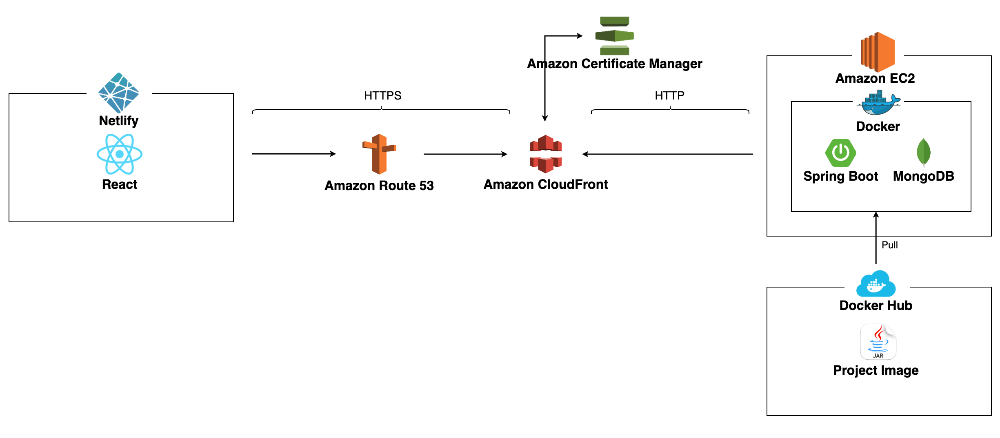
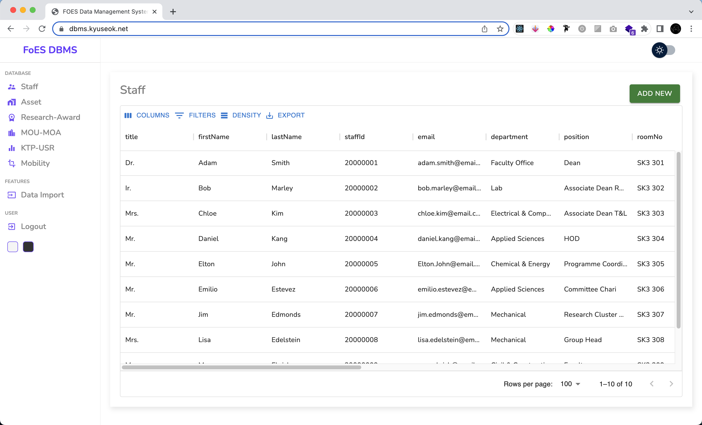

# Faculty of Science & Engineering 데이터 관리 시스템
대학교 마지막 학기 프로젝트로, 과학대학과 공과대학 데이터 관리하는 웹기반 어플리케이션 입니다. 

https://dbms.kyuseok.net

# 목차
- [Faculty of Science \& Engineering 데이터 관리 시스템](#faculty-of-science--engineering-데이터-관리-시스템)
- [목차](#목차)
  - [개발 환경](#개발-환경)
  - [사용 기술](#사용-기술)
    - [백엔드](#백엔드)
      - [주요 프레임워크 / 라이브러리](#주요-프레임워크--라이브러리)
      - [Build tool](#build-tool)
      - [Database](#database)
      - [Infra](#infra)
    - [프론트엔드](#프론트엔드)
  - [핵심 키워드](#핵심-키워드)
  - [시스템 아키텍쳐](#시스템-아키텍쳐)
    - [대쉬보드 디자인](#대쉬보드-디자인)
  - [프로젝트 목적](#프로젝트-목적)
  - [핵심 기능](#핵심-기능)
    - [React로 구현된 프론트엔드 어플리케이션](#react로-구현된-프론트엔드-어플리케이션)
    - [Spring Boot로 구현된 백엔드 어플리케이션](#spring-boot로-구현된-백엔드-어플리케이션)
    - [MongoDB를 사용한 데이터베이스](#mongodb를-사용한-데이터베이스)
    - [JUnit과 Mockito를 이용한 테스트코드](#junit과-mockito를-이용한-테스트코드)
    - [Spring Security를 이용한 JWT 토큰](#spring-security를-이용한-jwt-토큰)
    - [Docker \& Docker Hub](#docker--docker-hub)
    - [Netlify, AWS EC2, AWS CloudFront, AWS Route 53](#netlify-aws-ec2-aws-cloudfront-aws-route-53)
  - [관련 문서](#관련-문서)
  - [프로젝트를 통해 느낀점](#프로젝트를-통해-느낀점)

## 개발 환경
- IntelliJ
- Postman
- GitHub
- DataGrip
- Visual Studio Code
- Docker
- Docker Hub

## 사용 기술
### 백엔드
#### 주요 프레임워크 / 라이브러리
- Java 8 openjdk
- SpringBoot
- SpringBoot Security
- Spring Data JPA
- Lombok
- JUnit 5
- Mockito

#### Build tool
- Maven

#### Database
- MongoDB

#### Infra
- AWS EC2
- AWS Rout53
- Netlify
- Docker
- Docker Hub

### 프론트엔드
- Javascript
- Html/Css
- React
- Redux
- Material UI
- Sass

## 핵심 키워드

- 스프링 부트를 사용하여 웹 애플리케이션 기획부터 배포, 테스트 전과정 개발과 경험 확보
- JUnit, Mockito를 사용하여 테스트코드 작성
- AWS / 리눅스 기반 배포 인프라 구축
- Spring Data JPA를 사용한 도메인 설계
- REST API 기반 백엔드 서버 구축
- Layered 아키텍처

## 시스템 아키텍쳐

### 대쉬보드 디자인

    

## 프로젝트 목적

대학교 졸업 프로젝트인 Capstone Computing Project에서 기존에 학교에서 사용 중인 DBMS를 새로 개발하는 프로젝트를 받았습니다.

클라이언트의 요구 사항은 복잡한 기존에 시스템들을 직관적이고 쓰기 쉬운 웹 애플리케이션으로 대체하는 것이었습니다.

이 프로젝트는 제가 맡았던 프론트엔드 애플리케이션을 그대로 사용하고, PHP 라라벨로 개발되었던 백엔드를 자바 스프링으로 바꿔 포트폴리오용으로 프론트엔드와 백엔드까지 제가 전부 개발하였습니다.

욕심같아서는 Elixir, Clojure 같이 주목받는 함수형 프로그래밍 언어도 사용해보고 싶고, MSA를 배워서 복잡한 아키텍처도 구현해보고 싶었지만, 아직 쥬니어도 아닌 개발자 지망생으로서

우선은 **준비된 쥬니어 백엔드 개발자가 되자** 라는 눈앞의 목표를 최우선으로 삼고, 프로젝트를 하였습니다.

＇**준비된 쥬니어 백엔드 개발자가** 되기 위해 나는 무엇을 **준비**해야 할까?＇

결론은 간단하게도 프로그래밍에 대한 흥미와 열정.

그리고 그것들을 문서로 만들어 증명하고 공유하고 자기 PR을 하는 것이 저를 개발자 지망생이 아닌 개발자로 만들어줄 가장 빠르고 정확한 길이라고 생각했습니다.

## 핵심 기능

### React로 구현된 프론트엔드 어플리케이션

사용자 중심의 디자인과 UX를 통해 사용자 경험을 개선한 React 기반의 프론트엔드 어플리케이션입니다. 

REST API를 활용하여 서버와의 원활한 커뮤니케이션을 유지하고, Redux를 통한 상태 관리를 통해 애플리케이션의 안정적인 동작을 보장하였습니다.

이를 통해 사용자가 편안하고 스마트한 사용 경험을 제공하고 있습니다.

### Spring Boot로 구현된 백엔드 어플리케이션

Spring Boot 기반의 백엔드 어플리케이션은 REST API를 통해 사용자 요청을 처리하며,

레이어드 아키텍쳐와 인터페이스를 적용함으로써 코드 구조가 명확하게 정의되어 테스트 및 유지보수에 용이하게 구축되었습니다. 

이를 바탕으로 안정적이고 품질 높은 백엔드 서비스를 제공할 수 있습니다

### MongoDB를 사용한 데이터베이스

Document Based NoSQL인 MongoDB를 이용하여 데이터베이스를 구축하였습니다. 

기존에 라라벨로 구현된 백엔드 어플리케이션에서는 RDBMS인 MySQL을 사용하였습니다만

위 어플리케이션에서는 각 테이블간의 관계가 없기 때문에 NoSQL이 더 적합하다고 판단하였습니다.

프로젝트 완성후 개인적으로 이 프로젝트에서 데이터베이스는 Cassandra DB나 HBase같은 컴럼형 NoSQL이 더 적합하다는것을 깨달았고 기회가 된다면 위 데이터베이스로 업데이트 할 계획입니다.

### JUnit과 Mockito를 이용한 테스트코드

JUnit과 Mockito를 사용하여 백엔드 어플리케이션에 테스트 코드를 작성하였습니다.

Controller Layer, Service Layer, Persistance Layer에 있는 모든 메소드와 클래스에 테스트 코드를 작성하였습니다.

복잡한 계산이 필요한 로직이 없고 어플리케이션의 상당량이 라이브러리들로 구현되었기 때문에, behavior를 테스트 하기위한 Mock 테스트 위주로 작성하였습니다.

### Spring Security를 이용한 JWT 토큰

안전한 어플리케이션을 만들기위해 Spring Security를 이용한 JWT 인증기능을 만들었습니다.

로그인 인증시 발급받은 토큰을 이용하여 모든 HTTP 요청에 JWT인증을 하도록 구현하였습니다.

또한 Role Separation을 Admin과 User로 나누어 Admin은 관리자로써 어플리케이션을 사용할수 있는 유저를 제어하고, User는 일반 유저로써 어플리케이션 내의 모든 CRUD를 사용할수 있도록 구현하였습니다.

### Docker & Docker Hub

기존에 학교 서버에 배포하는 과정에서 이미 서버에 설치된 프로그램들의 버전들이 맞지 않아서 고생을 했었습니다.

그때의 '도커를 사용했으면 배포가 편했었을텐데' 라는 경험을 바탕으로 이번 프로젝트에서 도커를 적용시켰습니다.

Maven으로 만든 실행파일을 도커 이미지로 빌드한뒤 Docker Hub에 푸쉬하였고, 서버에서 바로 다운받아 실행시킬수 있도록 하였습니다.

### Netlify, AWS EC2, AWS CloudFront, AWS Route 53

프론트엔드 어플리케이션을 Netlify에 배포하고, 백엔드 어플리케이션은 EC2를 사용하여 배포하였습니다.

프론트엔드와 백엔드의 통신 과정에서 HTTPS로 인한 문제를 해결하기위해 AWS CloudFront를 사용하였으며, DNS 로는 Route 53을 이용하였습니다.

이 과정에서 마지막 학기에 배운 리눅스 서버 하드닝, 포트설정, 화이트 리스팅된 인바운드 아웃바운드 설정등을 적용해볼수있어서 뿌듯했습니다. 

## 관련 문서
Technical Investigation Document:       [link](./Resources/documents/TIS.pdf)

Technical Investigation Summary:        [link](./Resources/documents/TIS_Summary.pdf)

Software Requirements Speicification:   [link](./Resources/documents/SRS.pdf)

Software Architecture Speicification:   [link](./Resources/documents/SAS.pdf)

## 프로젝트를 통해 느낀점

이 프로젝트를 만들어 가는 과정에서 자바스크립트와 리액트를 사용할줄을 몰랐지만 필요한 기술들을 하나 하나 배우며 시작하였습니다.

한가지를 배워서 적용시키면 더 어려운 문제를 직면하면서 배울것이 많다는것을 느꼈습니다.

프로젝트를 진행하는 기간동안 사용해본적 없는 기술들을(리액트, 스프링 시큐리티, 도커, aws등) 적용하면서 발전해가는 제 자신을 발견하였고

**나는 시간만 주어진다면, 어떠한 문제라도 해결할수 있다** 라는 자신감을 갖게되었습니다.

또한 배우면 배울수록 스스로가 부족하고 더 보완해야 할 부분이 많다는걸 알게되었고, 이 모든 부분들을 즐겁게 배운다는 마인드로 감사하게 생각하고 있습니다.

풀스택 프로젝트를 진행하면서 아키텍쳐 전반적인 이해에 많은 도움이 되었고, 이 성공적인 경험을 발판삼아 더욱 성장할수 있다고 확신합니다.
